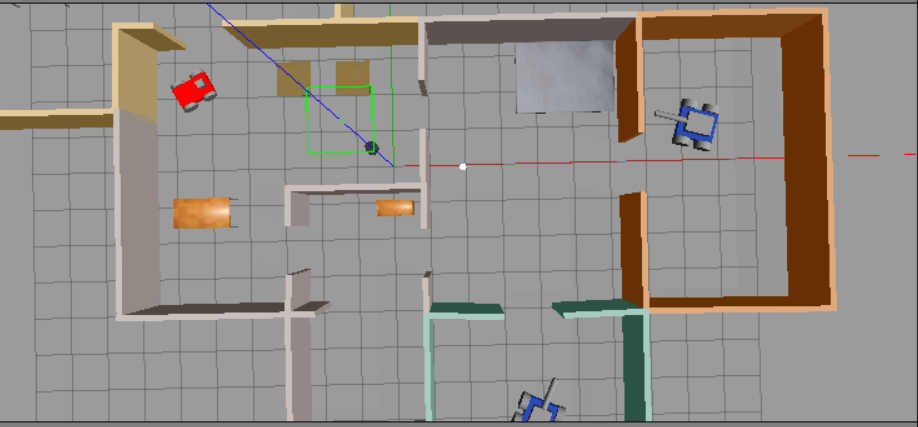
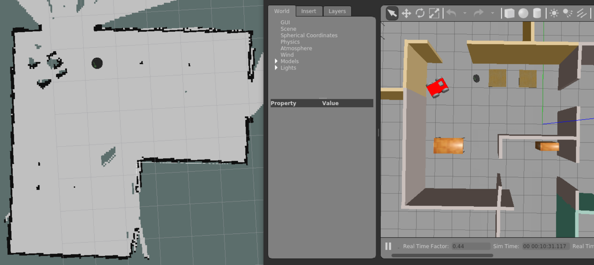
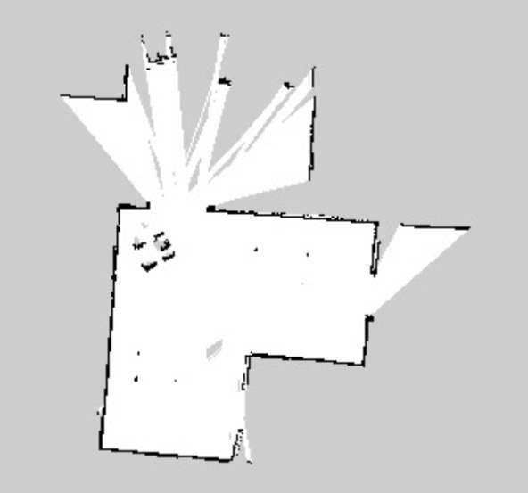
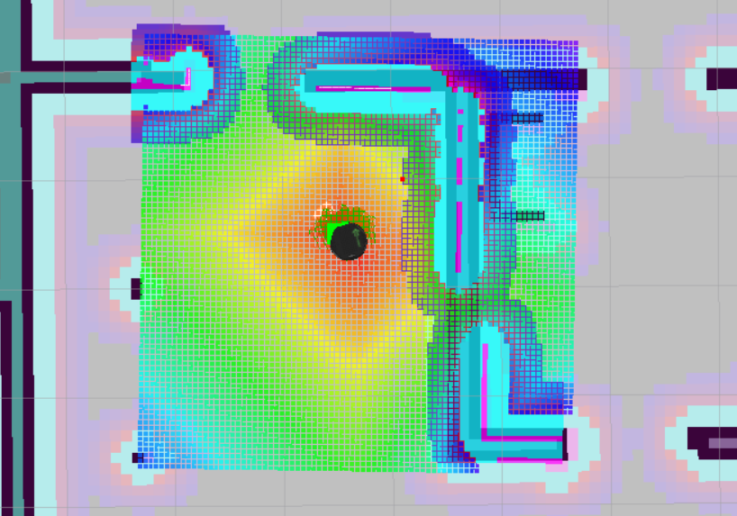

# Robotics-HomeServiceRobot

Home Service Robot is a project that simulated in ROS and Gazebo. The robot perform SLAM to map an indoor environment, localizes, and autonomously navigate to pick up item and place it to drop off point around the house. 

This project is part of course 6 in Udacity Robotics Software Engineer Nanodegree.

</a>

## Project Info
This project deploy turtlebot.
The project consist of:
1. Indoor environment created from Gazebo building editor.
2. 2D occupacy grid map generated from gmapping package.
3. Use Adaptive Monte Carlo Localization (AMCL) from amcl package to localize robot.
4. pick_objects node to navigate robot to pick up and drop off zone.
5. add_markers node that subscribe to robot odometry and publish markers to simulate object pick up and drop off.

</a>

## Prerequisites
1. Linux (Ubuntu 20.04)
2. ROS (Noetic) packages
3. Gazebo

## Dependencies
The following dependencies need to be installed:
```
$ sudo apt-get update && sudo apt-get upgrade -y
$ sudo apt-get install ros-noetic-turtlebot3
$ sudo apt-get install ros-noetic-teleop-twist-keyboard
$ sudo apt-get install ros-noetic-openslam-gmapping
```
1. ros-noetic-turtlebot3: Deploy a turtlebot in a gazebo environment by linking a world file to it
2. ros-noetic-teleop-twist-keyboard: Allow user to manually control a robot with keyboard inputs
3. ros-noetic-openslam-gmapping: Perform SLAM and build a map of environment with robot equipped laser range finder sensors.

## Project Structure
```
. Robotics-HomeServiceRobot
├── README.md
├── slam_testing_map.pgm                # Map file generated from SLAM testing
├── slam_testing_map.yaml               # Map file generated from SLAM testing
├── config                              # Marker configurations for pick up & drop off location
|   └── marker_config.yaml
├── add_markers                         # Publishes markers to Rviz to simulate the object pick-up and drop-off
│   ├── CMakeLists.txt
│   ├── package.xml
│   ├── launch
|   |   └── home_service_rviz.launch
│   └── src
|       ├── add_markers_time.cpp
│       └── add_markers.cpp
├── maps                                # Simulation maps
|   ├── myrobot0125map.pgm
|   └── myrobot0125map.yaml
├── rvizConfig                          # Simulation Rviz file with marker
|   └── home_service.rviz
├── scripts                             # Shell scripts
|   ├── add_markers.sh
|   ├── home_service.sh
|   ├── pick_objects.sh
|   ├── test_navigation.sh
|   └── test_slam.sh
├── worlds                              # Simulation world
|   └── Project1_MyHomeWorld.world
├── images                              # Simulation images
│   ├── gazebo.PNG
│   ├── slam_testing.PNG
│   ├── slam_testing_map_sample.PNG
│   ├── home_service_robot.gif
│   └── sampleResultAfterDelivered.PNG
└── pick_objects                        # Commands the robot to navigate to the desired pick-up and drop-off zones
    ├── CMakeLists.txt
    ├── package.xml
    └── src
        └── pick_objects.cpp
```

## How to build
1. Initialize a catkin workspace and clone this project to catkin src directory
```
$ mkdir -p catkin_ws/src
$ cd catkin_ws/src
$ catkin_init_workspace
$ git clone https://github.com/yeetengang/Robotics-MapMyWorld.git
$ mv Robotics-HomeServiceRobot/* ./
```

2. Build
```
$ cd ..
$ catkin_make
```

3. Source environment
```
$ source devel/setup.bash
```

5. Make scripts to be executable
```
$ cd src/scripts
$ sudo chmod +x *.sh
```

## SLAM Testing
Perform SLAM by teleoperating robot via teleop keyboard. SLAM (simultaneous localization and mapping) is a method that build a map and localize your vehicle in that map at the same time, which allow robot to map out unknown environments. The map information will helps in path planning and obstacle avoidance.
```
$ ./test_slam.sh
```
This shell script will launch:
1. turtlebot_world.launch to deploy turtlebot into my world.
2. gmapping_demo.launch to perform SLAM.
3. view_navigation.launch to observe map in Rviz.
4. keyboard_teleop.launch to allow teleoperating robot via keyboard.

</a>

Use keyboard to navigate around the world, save the map via commands below:
```
rosrun map_server map_saver -f <map-location-and-name>
```
Below is the sample result after I navigate some part of my world:

</a>

## Localization and Navigation Testing
In Localization and Navigation testing, we will use AMCL package. With the supports of AMCL package, it implement Adaptive Monte Carlo Localization approach, which uses particle filter for tracking pose of the robot with respect to the known map provided. 
```
$ ./test_navigation.sh
```
This shell script will launch:
1. turtlebot_world.launch to deploy turtlebot into my world.
2. amcl_demo.launch to localize turtlebot with my previously generated map file.
3. view_navigation.launch to observe map in Rviz.

Press the 2D Nav Goal button in Rviz and click on map to select goal for robot to navigate.

## Navigation Goal Node
In this part, we use pick_objects package, which autonomously navigate robot to pick-up zone and drop-off zone.
pick_objects.cpp include function to navigate robot from starting location to pick-up location. Once robot reached pick-up location, it stay there for 5 seconds and then proceed to move to drop-off location. 
With the support of AMCL package, robot is able to track its position in the known map provided. Therefore, robot is able to plan the path to reach its destination (pick-up/drop-off location), while avoiding obstacles and walls of the environment.

Dependencies of pick_objects package:
1. move_base_msgs: ROS package that is used to communicate with the move_base node. The move_base node links together a global and local planner to accomplish its global navigation task
2. action_lib: ROS package that provide tools to send goals or get feedbacks/state from a ROS entities (robot).
3. roscpp: Interface with ROS topics, services, and parameters in C++ scripts.

```
$ ./pick_objects.sh
```
This shell script will launch:
1. turtlebot_world.launch to deploy turtlebot into my world.
2. amcl_demo.launch to localize turtlebot with my previously generated map file.
3. home_service_rviz.launch which will take my Rviz configuration to have better view of pick-up zone and drop-off zone.
4. pick_objects node with pick_objects.cpp function.

## Virtual Objects
Model a virtual object to simulate item pick-up and drop off events.
add_markers_time.cpp include function to spawn marker at pick-up location for 5 seconds. Then, hide the marker for another 5 seconds to simulate item being picked up. Finally, re-spawn the marker at drop-off location to simulate item being dropped off at drop-off point.

Dependencies of add_markers package:
1. visualization_msgs: ROS package for set of messages used by Rviz, marker message is used to send visualization "markers" such as boxes, spheres, arrows, lines, etc. The virtual objects in this part utilize this package's marker, which can publish messages that will capture and shown in Rviz. 
```
$ ./add_markers.sh
```
This shell script will launch:
1. turtlebot_world.launch to deploy turtlebot into my world.
2. amcl_demo.launch to localize turtlebot with my previously generated map file.
3. home_service_rviz.launch which will take my Rviz configuration to have better view of pick-up zone and drop-off zone.
4. add_markers node with add_markers_time.cpp function, pick-up drop-off location params are defined in marker_config.yaml file.

## Home Service Robot
Simulate full home service robot which will autonomously navigate to pick up zone, pick up item, navigate to drop off point, and drop the item at drop-off point:
```
$ ./home_service.sh
```
This shell script combine pick_objects and add_markers nodes to simulate a complete event of a robot navigate, pick up item at point A, carrying the item, and drop off item to point B.
It takes the function from pick_objects.cpp and add_markers.cpp.
add_markers.cpp works similar as add_markers_time.cpp, but instead of hidding the virtual object after 5 seconds, it subscribe to odometry values to know robot current location. With this data, the function will hide the virtual object only when the robot is close enough to the virtual objects, or re-spawn the virtual object only when the robot is close enough to the drop-off point.

The robot will use the generated map and localize itself with acml package. 
Robot will navigate to a virtual object, pick-up the object, and navigate back to drop-off zone.
The virtual object, representing as a green cube, will disappear when robot get close to it (To indicate pick-up action), and re-appear at drop-off zone when robot navigate to drop off point.
Result can be seen from the gif displayed at above.

</a>

